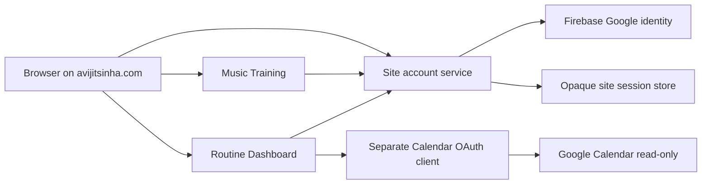

# Common account and privacy plan

**Status: local common-account UI, browser/session and internal validation cores implemented; Music Training and Routine Dashboard both consume the common account locally; the public services homepage and canonical privacy policy are published.** This plan covers the shared account for `avijitsinha.com`, service-specific authorization, and the public privacy surface. It does not authorize account-service/Dashboard deployment, OAuth changes or cloud provisioning.

## Outcomes

- Signing in on one production service signs the browser into the other services on `avijitsinha.com`.
- Common sign-in requests only basic Google identity through the existing Firebase project.
- Each service separately requests any additional access it needs, at the moment the user enables that feature.
- Music Training never requires or receives Google Calendar access.
- Routine Dashboard requests only read-only Calendar access after an explicit **Connect Google Calendar** action.
- A single public privacy policy covers the site account and contains a clearly labeled section for each service.
- Authentication is shared; authorization, credentials, data, and deletion behavior remain service-specific.

## Target boundary



The account service owns identity verification, the site user identifier, session rotation, inactivity expiry, current-session logout and later all-session/account deletion orchestration. It issues a host-only `__Host-` cookie with `Secure`, `HttpOnly`, `SameSite=Lax` and `Path=/`. Production and beta use host-only cookies and separate backing configuration, so a session on `beta.avijitsinha.com` is not a production session.

The session token is random and opaque. Only its hash is stored. It expires after 30 consecutive days without authenticated use and rotates during active use; there is no fixed absolute logout for a regularly used session. Recent Google/Firebase authentication is still required for sensitive actions. State-changing routes require exact-origin and CSRF checks.

Service backends validate the common session through a narrow authenticated account-service contract. They receive only the stable internal site user identifier and minimal profile fields needed for the request. They never accept a browser-supplied user ID, email, Firebase UID, Google subject, or service tenant key as authority. For Calendar account binding, the dashboard submits Google's server-verified OAuth subject to an internal account-service comparison and receives only match/no-match; it does not receive the stored Firebase/provider subject. A service cannot use the common account contract to read another service's data or credentials.

The public reverse proxy must strip the site-session cookie before forwarding requests to a service that does not need it. Static clients read sign-in state through the account API rather than reading the `HttpOnly` cookie. Because all applications share one origin, an XSS flaw in any application is a site-wide risk; each application needs CSP, output safety, dependency review and CSRF defenses.

## Google authorization layout

Use one Google Cloud project and one Google Auth Platform brand/audience/privacy configuration, with distinct OAuth clients beneath it:

| Client | Purpose | Requested access |
|---|---|---|
| Firebase Google provider | Common site sign-in | `openid`, `userinfo.email` and `userinfo.profile` only |
| Routine Dashboard backend client | Optional Calendar connection | `openid` and `calendar.events.readonly` |
| Future Tasks client or reviewed incremental flow | Optional Tasks connection | `tasks.readonly` only when implemented |

The account service never receives Calendar or Tasks refresh tokens. Routine Dashboard owns its Calendar grant, encrypted token, normalized cache and disconnect flow. Disconnecting Calendar leaves the common site session active. Global sign-out invalidates the site session but does not silently revoke a service grant; account deletion must explicitly invoke every registered service's deletion workflow.

Beta and production use distinct OAuth clients, redirect URIs, secrets and data stores even when they remain in the same approved Cloud project. No client secret is placed in browser configuration, source, images, shell history or policy text.

The shared Google Auth Platform audience is confirmed as External / In production. Google test users do not apply in that state, and the publishing status by itself neither exposes a site route nor admits a common account. During restricted beta, the account service remains the authoritative admission boundary: after Firebase verifies identity, it accepts only the exact Firebase UIDs in its secret-backed two-account allowlist and rejects all others before site-user or session persistence. Calendar still requires a separate explicit Dashboard authorization. The shared Data Access configuration declares only `openid`, `https://www.googleapis.com/auth/userinfo.email` and `https://www.googleapis.com/auth/userinfo.profile`; it does not declare Calendar or Tasks access. On 2026-09-30, the Audience page showed aggregate usage of 1 user against the 100-user cap and no verification warning. The remaining OAuth client inventory must be reviewed before the Calendar client is created.

## Public privacy structure

The public website serves the canonical policy without authentication at:

```text
https://avijitsinha.com/privacy/
```

The homepage footer and account UI link to that exact URL. The compatible deployed Music Training release also receives an in-product link before the policy is published. The policy has these sections:

1. site owner and contact channel;
2. common account and Google sign-in data;
3. Music Training data and browser-local preferences;
4. Routine Dashboard identity, preferences, Calendar authorization and cached event data;
5. infrastructure processing, security and operational logs;
6. service-specific retention and deletion;
7. sharing, sale, advertising and model-training exclusions;
8. Google API Services User Data Policy and Limited Use disclosure;
9. policy changes and effective date.

Google's [OAuth branding requirements](https://support.google.com/cloud/answer/15549049) require the homepage and consent screen to use the same discoverable privacy URL, while the [Google API Services User Data Policy](https://developers.google.com/terms/api-services-user-data-policy) requires accurate disclosure of access, use, storage and sharing. The Routine Dashboard section must say plainly that Calendar access is optional, read-only and not granted by common sign-in. A Music Training user does not grant Calendar access. Future services receive their own section before collecting data.

The initial policy makes only bounded commitments supported by the beta design: browser-local preferences remain until cleared; profile data remains while an account is active or until deletion is requested; Calendar disconnect deletes active credentials/cache/jobs even if best-effort provider revocation fails; operational logs normally retain 30 days; and hosted beta database backups may retain deleted records for up to seven days. Until automated account deletion is implemented, the published deletion path is a verified manual request to the listed operator email. Production retention can change only after its infrastructure is configured, the policy is updated and affected users receive any required notice.

Publication on 2026-09-30 deployed website revision `avijitsinha-com-00005-jt6` and compatible Music Training revision `music-training-00012-6v9`, each at 100% traffic with internal ingress preserved behind the existing reverse proxy. Public verification returned HTTPS `200` for the homepage and exact policy URL, rendered the policy in a real browser, confirmed its Google Limited Use and deletion disclosures, and confirmed the Music bundle contains the policy link without the prior credential-log or third-party fallback-avatar behavior. This publication did not deploy the account service or Routine Dashboard.

The user then confirmed that the shared Google Auth Platform app name `avijitsinha.com` passed brand verification and the branding was published with the live homepage and privacy-policy URLs. On 2026-09-30, the user also confirmed that Data Access initially contained no scopes and then added exactly the three common-login scopes above. No Calendar or Tasks scope was added. The same review confirmed External / In production, aggregate usage of 1/100 users and no Audience-page verification warning. OAuth client inventory review and the separate Dashboard OAuth client remain later gates.

## Incremental execution plan

### A0 — Architecture and immediate safety

- [x] Approve the common-account/service-specific-authorization boundary.
- [x] Choose a site-wide policy with separate service sections.
- [x] Remove credential/token logging and the unused browser bearer-token helper from Music Training; verify its current sign-in build.
- [x] Freeze new app-specific login/session designs while the common contract is implemented.

### A1 — Common account contract

- [x] Specify public account endpoints, internal session validation, generic errors and profile minimization in [the account contract](common-account-api.md).
- [x] Specify the PostgreSQL user/session schema, 30-day inactivity, rotation, revocation and CSRF behavior.
- [x] Define service identity authentication and exact audiences for internal validation.
- [x] Add synthetic tests for fixation, replay, revocation and browser tenant-identifier spoofing.
- [x] Add exact-audience internal OIDC tests for public callers and cross-service confusion.

### A2 — Local account service

- [x] Add a separately packaged account service owned by this repository.
- [x] Reuse Firebase Google sign-in for identity only and verify ID tokens server-side.
- [x] Issue the opaque host-wide session and implement `/me` and current-session logout.
- [x] Implement exact-audience service authentication, internal session validation and Dashboard-only provider-subject matching.
- [x] Keep beta admission restricted to the reviewed Firebase UID allowlist.
- [x] Add the `/account/` Firebase redirect UI that establishes the common session and calls `/me` on initialization.

### A3 — Service integrations

- [x] Replace Music Training's independent Firebase UI state with the common account API.
- [x] Migrate Routine Dashboard from its app-specific session to common-session validation.
- [x] Preserve Routine Dashboard's separate Calendar OAuth state, consent, token and cache boundary.
- [x] Verify structurally and in tests that Music Training makes no Dashboard request and a first Dashboard visit creates only a minimal tenant until explicit Calendar consent.

### A4 — Lifecycle and privacy controls

- [ ] Implement global current-session and all-session logout.
- [ ] Implement service disconnect and global account deletion orchestration.
- [ ] Test the published active-data deletion, 30-day log and seven-day beta-backup retention against deployed infrastructure; production retention remains a later decision.
- [x] Add the public service description, `/privacy/`, Google Limited Use disclosure and manual deletion instructions with matching homepage/account/Music links.

### A5 — Reviewed beta rollout

- [ ] Reconcile existing Firebase/OAuth/cloud prerequisites with the common account design.
- [ ] Provision least-privilege identities, durable storage and secrets in separate reviewed batches.
- [ ] Deploy without a public route, then test the proxy, session validation and log redaction.
- [ ] Run two-account isolation and Music-only/Calendar-connected acceptance scenarios.

### A6 — Production readiness

- [ ] Complete applicable Google brand and sensitive-scope verification.
- [ ] Review all policy statements against observed production configuration.
- [ ] Deploy only after explicit authorization, monitoring, deletion and rollback checks.

## Migration constraints

Routine Dashboard's undeployed app-specific session, Firebase client/Admin dependencies, login routes and hosted session tables have been removed. The account service now owns opaque-token hashing, rotation, inactivity, CSRF, Firebase verification and restricted beta admission. Dashboard forwards only the two common cookies to the exact-audience internal API and maps the returned site UUID to its own tenant.

Music Training now reads the minimal profile from `/api/account/me`, sends sign-in through `/account/`, and revokes the current common session through the CSRF-protected account endpoint. It contains no Firebase SDK or configuration, does not handle provider credentials, and keeps only training options in browser-local storage. The reverse proxy must still strip cookies before forwarding static Music requests while routing account API calls to the account service.

No phase silently broadens Google scopes, makes Calendar mandatory, shares service tokens, weakens tenant scoping, trusts proxy identity headers, or publishes unfinished privacy claims.
